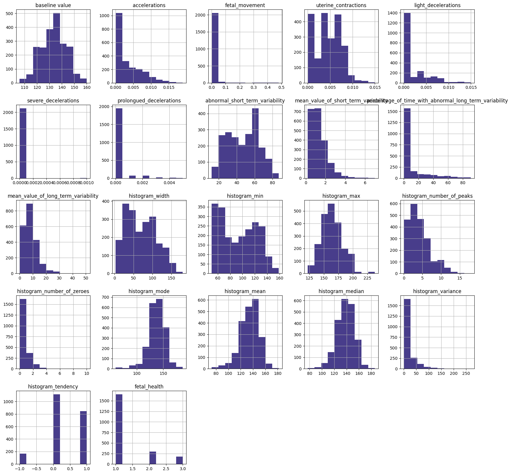
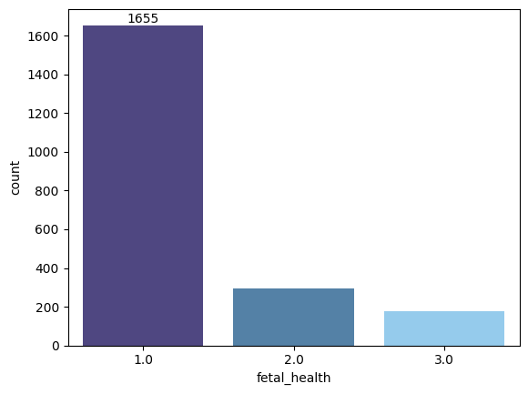
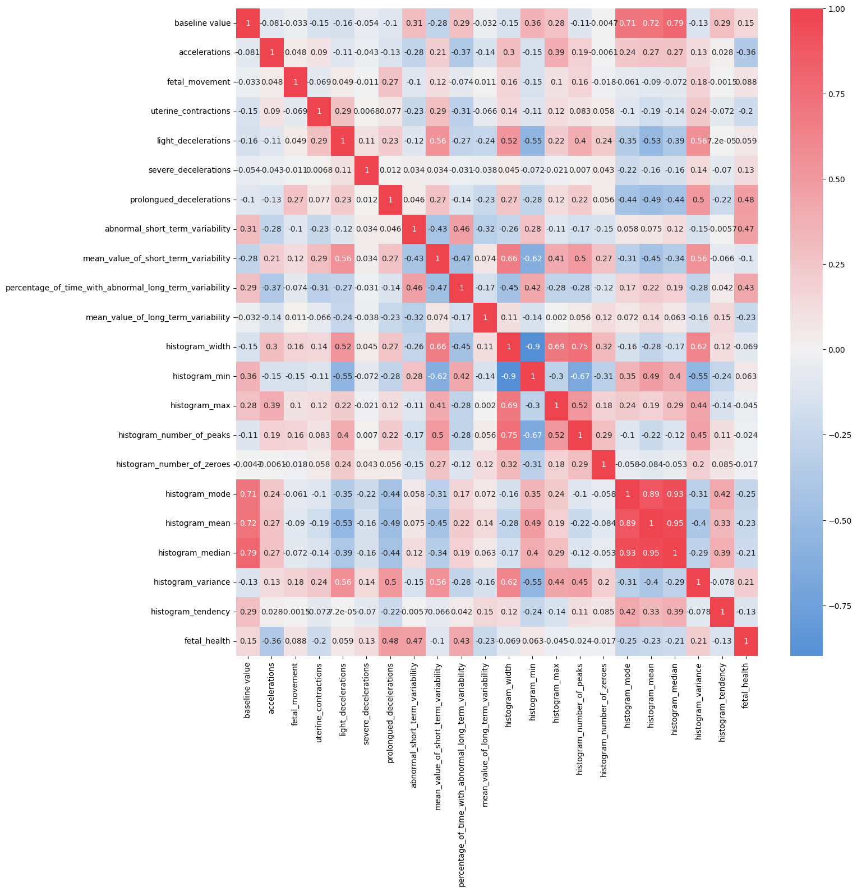
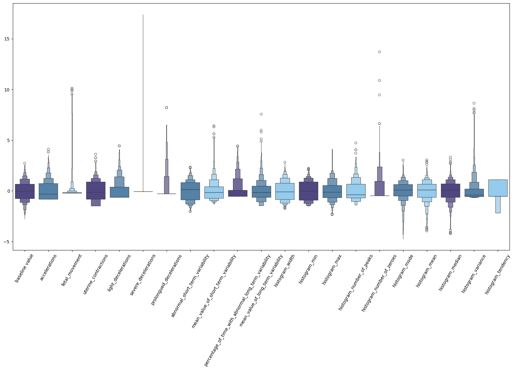
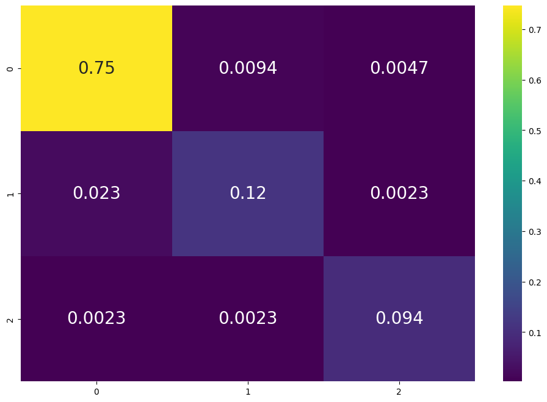

Setup libraries


```python
import numpy as np
import pandas as pd
import matplotlib.pyplot as plt
import seaborn as sns

from sklearn.model_selection import train_test_split
from sklearn.preprocessing import StandardScaler
from sklearn.pipeline import Pipeline

from sklearn.linear_model import LogisticRegression
from sklearn.tree import DecisionTreeClassifier
from sklearn.ensemble import GradientBoostingClassifier
from sklearn.ensemble import RandomForestClassifier
from sklearn.neighbors import KNeighborsClassifier
from sklearn.svm import SVC

from sklearn.model_selection import GridSearchCV
from sklearn.model_selection import cross_val_score
from sklearn.metrics import confusion_matrix, classification_report, accuracy_score
from sklearn import metrics
from sklearn.metrics import roc_curve, auc, roc_auc_score
```

And the connection to Google Drive to get the data:


```python
from google.colab import drive
drive.mount('/content/gdrive')
```

    Mounted at /content/gdrive
    

### LOADING DATA


```python
data = pd.read_csv("/content/gdrive/My Drive/Fetal Health Classification/fetal_health.csv")
data.head()
```


  <div id="df-29711816-aaad-4ef1-b09f-bce8b1431be9" class="colab-df-container">
    <div>
<style scoped>
    .dataframe tbody tr th:only-of-type {
        vertical-align: middle;
    }

    .dataframe tbody tr th {
        vertical-align: top;
    }

    .dataframe thead th {
        text-align: right;
    }
</style>
<table border="1" class="dataframe">
  <thead>
    <tr style="text-align: right;">
      <th></th>
      <th>baseline value</th>
      <th>accelerations</th>
      <th>fetal_movement</th>
      <th>uterine_contractions</th>
      <th>light_decelerations</th>
      <th>severe_decelerations</th>
      <th>prolongued_decelerations</th>
      <th>abnormal_short_term_variability</th>
      <th>mean_value_of_short_term_variability</th>
      <th>percentage_of_time_with_abnormal_long_term_variability</th>
      <th>...</th>
      <th>histogram_min</th>
      <th>histogram_max</th>
      <th>histogram_number_of_peaks</th>
      <th>histogram_number_of_zeroes</th>
      <th>histogram_mode</th>
      <th>histogram_mean</th>
      <th>histogram_median</th>
      <th>histogram_variance</th>
      <th>histogram_tendency</th>
      <th>fetal_health</th>
    </tr>
  </thead>
  <tbody>
    <tr>
      <th>0</th>
      <td>120.0</td>
      <td>0.000</td>
      <td>0.0</td>
      <td>0.000</td>
      <td>0.000</td>
      <td>0.0</td>
      <td>0.0</td>
      <td>73.0</td>
      <td>0.5</td>
      <td>43.0</td>
      <td>...</td>
      <td>62.0</td>
      <td>126.0</td>
      <td>2.0</td>
      <td>0.0</td>
      <td>120.0</td>
      <td>137.0</td>
      <td>121.0</td>
      <td>73.0</td>
      <td>1.0</td>
      <td>2.0</td>
    </tr>
    <tr>
      <th>1</th>
      <td>132.0</td>
      <td>0.006</td>
      <td>0.0</td>
      <td>0.006</td>
      <td>0.003</td>
      <td>0.0</td>
      <td>0.0</td>
      <td>17.0</td>
      <td>2.1</td>
      <td>0.0</td>
      <td>...</td>
      <td>68.0</td>
      <td>198.0</td>
      <td>6.0</td>
      <td>1.0</td>
      <td>141.0</td>
      <td>136.0</td>
      <td>140.0</td>
      <td>12.0</td>
      <td>0.0</td>
      <td>1.0</td>
    </tr>
    <tr>
      <th>2</th>
      <td>133.0</td>
      <td>0.003</td>
      <td>0.0</td>
      <td>0.008</td>
      <td>0.003</td>
      <td>0.0</td>
      <td>0.0</td>
      <td>16.0</td>
      <td>2.1</td>
      <td>0.0</td>
      <td>...</td>
      <td>68.0</td>
      <td>198.0</td>
      <td>5.0</td>
      <td>1.0</td>
      <td>141.0</td>
      <td>135.0</td>
      <td>138.0</td>
      <td>13.0</td>
      <td>0.0</td>
      <td>1.0</td>
    </tr>
    <tr>
      <th>3</th>
      <td>134.0</td>
      <td>0.003</td>
      <td>0.0</td>
      <td>0.008</td>
      <td>0.003</td>
      <td>0.0</td>
      <td>0.0</td>
      <td>16.0</td>
      <td>2.4</td>
      <td>0.0</td>
      <td>...</td>
      <td>53.0</td>
      <td>170.0</td>
      <td>11.0</td>
      <td>0.0</td>
      <td>137.0</td>
      <td>134.0</td>
      <td>137.0</td>
      <td>13.0</td>
      <td>1.0</td>
      <td>1.0</td>
    </tr>
    <tr>
      <th>4</th>
      <td>132.0</td>
      <td>0.007</td>
      <td>0.0</td>
      <td>0.008</td>
      <td>0.000</td>
      <td>0.0</td>
      <td>0.0</td>
      <td>16.0</td>
      <td>2.4</td>
      <td>0.0</td>
      <td>...</td>
      <td>53.0</td>
      <td>170.0</td>
      <td>9.0</td>
      <td>0.0</td>
      <td>137.0</td>
      <td>136.0</td>
      <td>138.0</td>
      <td>11.0</td>
      <td>1.0</td>
      <td>1.0</td>
    </tr>
  </tbody>
</table>
<p>5 rows × 22 columns</p>
</div>
    <div class="colab-df-buttons">

  <div class="colab-df-container">
    <button class="colab-df-convert" onclick="convertToInteractive('df-29711816-aaad-4ef1-b09f-bce8b1431be9')"
            title="Convert this dataframe to an interactive table."
            style="display:none;">

  <svg xmlns="http://www.w3.org/2000/svg" height="24px" viewBox="0 -960 960 960">
    <path d="M120-120v-720h720v720H120Zm60-500h600v-160H180v160Zm220 220h160v-160H400v160Zm0 220h160v-160H400v160ZM180-400h160v-160H180v160Zm440 0h160v-160H620v160ZM180-180h160v-160H180v160Zm440 0h160v-160H620v160Z"/>
  </svg>
    </button>

  <style>
    .colab-df-container {
      display:flex;
      gap: 12px;
    }

    .colab-df-convert {
      background-color: #E8F0FE;
      border: none;
      border-radius: 50%;
      cursor: pointer;
      display: none;
      fill: #1967D2;
      height: 32px;
      padding: 0 0 0 0;
      width: 32px;
    }

    .colab-df-convert:hover {
      background-color: #E2EBFA;
      box-shadow: 0px 1px 2px rgba(60, 64, 67, 0.3), 0px 1px 3px 1px rgba(60, 64, 67, 0.15);
      fill: #174EA6;
    }

    .colab-df-buttons div {
      margin-bottom: 4px;
    }

    [theme=dark] .colab-df-convert {
      background-color: #3B4455;
      fill: #D2E3FC;
    }

    [theme=dark] .colab-df-convert:hover {
      background-color: #434B5C;
      box-shadow: 0px 1px 3px 1px rgba(0, 0, 0, 0.15);
      filter: drop-shadow(0px 1px 2px rgba(0, 0, 0, 0.3));
      fill: #FFFFFF;
    }
  </style>

    <script>
      const buttonEl =
        document.querySelector('#df-29711816-aaad-4ef1-b09f-bce8b1431be9 button.colab-df-convert');
      buttonEl.style.display =
        google.colab.kernel.accessAllowed ? 'block' : 'none';

      async function convertToInteractive(key) {
        const element = document.querySelector('#df-29711816-aaad-4ef1-b09f-bce8b1431be9');
        const dataTable =
          await google.colab.kernel.invokeFunction('convertToInteractive',
                                                    [key], {});
        if (!dataTable) return;

        const docLinkHtml = 'Like what you see? Visit the ' +
          '<a target="_blank" href=https://colab.research.google.com/notebooks/data_table.ipynb>data table notebook</a>'
          + ' to learn more about interactive tables.';
        element.innerHTML = '';
        dataTable['output_type'] = 'display_data';
        await google.colab.output.renderOutput(dataTable, element);
        const docLink = document.createElement('div');
        docLink.innerHTML = docLinkHtml;
        element.appendChild(docLink);
      }
    </script>
  </div>


<div id="df-3131fdb4-3e93-406e-8f1b-476391fb2458">
  <button class="colab-df-quickchart" onclick="quickchart('df-3131fdb4-3e93-406e-8f1b-476391fb2458')"
            title="Suggest charts"
            style="display:none;">

<svg xmlns="http://www.w3.org/2000/svg" height="24px"viewBox="0 0 24 24"
     width="24px">
    <g>
        <path d="M19 3H5c-1.1 0-2 .9-2 2v14c0 1.1.9 2 2 2h14c1.1 0 2-.9 2-2V5c0-1.1-.9-2-2-2zM9 17H7v-7h2v7zm4 0h-2V7h2v10zm4 0h-2v-4h2v4z"/>
    </g>
</svg>
  </button>

<style>
  .colab-df-quickchart {
      --bg-color: #E8F0FE;
      --fill-color: #1967D2;
      --hover-bg-color: #E2EBFA;
      --hover-fill-color: #174EA6;
      --disabled-fill-color: #AAA;
      --disabled-bg-color: #DDD;
  }

  [theme=dark] .colab-df-quickchart {
      --bg-color: #3B4455;
      --fill-color: #D2E3FC;
      --hover-bg-color: #434B5C;
      --hover-fill-color: #FFFFFF;
      --disabled-bg-color: #3B4455;
      --disabled-fill-color: #666;
  }

  .colab-df-quickchart {
    background-color: var(--bg-color);
    border: none;
    border-radius: 50%;
    cursor: pointer;
    display: none;
    fill: var(--fill-color);
    height: 32px;
    padding: 0;
    width: 32px;
  }

  .colab-df-quickchart:hover {
    background-color: var(--hover-bg-color);
    box-shadow: 0 1px 2px rgba(60, 64, 67, 0.3), 0 1px 3px 1px rgba(60, 64, 67, 0.15);
    fill: var(--button-hover-fill-color);
  }

  .colab-df-quickchart-complete:disabled,
  .colab-df-quickchart-complete:disabled:hover {
    background-color: var(--disabled-bg-color);
    fill: var(--disabled-fill-color);
    box-shadow: none;
  }

  .colab-df-spinner {
    border: 2px solid var(--fill-color);
    border-color: transparent;
    border-bottom-color: var(--fill-color);
    animation:
      spin 1s steps(1) infinite;
  }

  @keyframes spin {
    0% {
      border-color: transparent;
      border-bottom-color: var(--fill-color);
      border-left-color: var(--fill-color);
    }
    20% {
      border-color: transparent;
      border-left-color: var(--fill-color);
      border-top-color: var(--fill-color);
    }
    30% {
      border-color: transparent;
      border-left-color: var(--fill-color);
      border-top-color: var(--fill-color);
      border-right-color: var(--fill-color);
    }
    40% {
      border-color: transparent;
      border-right-color: var(--fill-color);
      border-top-color: var(--fill-color);
    }
    60% {
      border-color: transparent;
      border-right-color: var(--fill-color);
    }
    80% {
      border-color: transparent;
      border-right-color: var(--fill-color);
      border-bottom-color: var(--fill-color);
    }
    90% {
      border-color: transparent;
      border-bottom-color: var(--fill-color);
    }
  }
</style>

  <script>
    async function quickchart(key) {
      const quickchartButtonEl =
        document.querySelector('#' + key + ' button');
      quickchartButtonEl.disabled = true;  // To prevent multiple clicks.
      quickchartButtonEl.classList.add('colab-df-spinner');
      try {
        const charts = await google.colab.kernel.invokeFunction(
            'suggestCharts', [key], {});
      } catch (error) {
        console.error('Error during call to suggestCharts:', error);
      }
      quickchartButtonEl.classList.remove('colab-df-spinner');
      quickchartButtonEl.classList.add('colab-df-quickchart-complete');
    }
    (() => {
      let quickchartButtonEl =
        document.querySelector('#df-3131fdb4-3e93-406e-8f1b-476391fb2458 button');
      quickchartButtonEl.style.display =
        google.colab.kernel.accessAllowed ? 'block' : 'none';
    })();
  </script>
</div>
    </div>
  </div>


```python
data.info()
```

    <class 'pandas.core.frame.DataFrame'>
    RangeIndex: 2126 entries, 0 to 2125
    Data columns (total 22 columns):
     #   Column                                                  Non-Null Count  Dtype  
    ---  ------                                                  --------------  -----  
     0   baseline value                                          2126 non-null   float64
     1   accelerations                                           2126 non-null   float64
     2   fetal_movement                                          2126 non-null   float64
     3   uterine_contractions                                    2126 non-null   float64
     4   light_decelerations                                     2126 non-null   float64
     5   severe_decelerations                                    2126 non-null   float64
     6   prolongued_decelerations                                2126 non-null   float64
     7   abnormal_short_term_variability                         2126 non-null   float64
     8   mean_value_of_short_term_variability                    2126 non-null   float64
     9   percentage_of_time_with_abnormal_long_term_variability  2126 non-null   float64
     10  mean_value_of_long_term_variability                     2126 non-null   float64
     11  histogram_width                                         2126 non-null   float64
     12  histogram_min                                           2126 non-null   float64
     13  histogram_max                                           2126 non-null   float64
     14  histogram_number_of_peaks                               2126 non-null   float64
     15  histogram_number_of_zeroes                              2126 non-null   float64
     16  histogram_mode                                          2126 non-null   float64
     17  histogram_mean                                          2126 non-null   float64
     18  histogram_median                                        2126 non-null   float64
     19  histogram_variance                                      2126 non-null   float64
     20  histogram_tendency                                      2126 non-null   float64
     21  fetal_health                                            2126 non-null   float64
    dtypes: float64(22)
    memory usage: 365.5 KB
    


```python
data.describe().T
```


  <div id="df-40c06aaa-3761-404a-8f2f-48996534e602" class="colab-df-container">
    <div>
<style scoped>
    .dataframe tbody tr th:only-of-type {
        vertical-align: middle;
    }

    .dataframe tbody tr th {
        vertical-align: top;
    }

    .dataframe thead th {
        text-align: right;
    }
</style>
<table border="1" class="dataframe">
  <thead>
    <tr style="text-align: right;">
      <th></th>
      <th>count</th>
      <th>mean</th>
      <th>std</th>
      <th>min</th>
      <th>25%</th>
      <th>50%</th>
      <th>75%</th>
      <th>max</th>
    </tr>
  </thead>
  <tbody>
    <tr>
      <th>baseline value</th>
      <td>2126.0</td>
      <td>133.303857</td>
      <td>9.840844</td>
      <td>106.0</td>
      <td>126.000</td>
      <td>133.000</td>
      <td>140.000</td>
      <td>160.000</td>
    </tr>
    <tr>
      <th>accelerations</th>
      <td>2126.0</td>
      <td>0.003178</td>
      <td>0.003866</td>
      <td>0.0</td>
      <td>0.000</td>
      <td>0.002</td>
      <td>0.006</td>
      <td>0.019</td>
    </tr>
    <tr>
      <th>fetal_movement</th>
      <td>2126.0</td>
      <td>0.009481</td>
      <td>0.046666</td>
      <td>0.0</td>
      <td>0.000</td>
      <td>0.000</td>
      <td>0.003</td>
      <td>0.481</td>
    </tr>
    <tr>
      <th>uterine_contractions</th>
      <td>2126.0</td>
      <td>0.004366</td>
      <td>0.002946</td>
      <td>0.0</td>
      <td>0.002</td>
      <td>0.004</td>
      <td>0.007</td>
      <td>0.015</td>
    </tr>
    <tr>
      <th>light_decelerations</th>
      <td>2126.0</td>
      <td>0.001889</td>
      <td>0.002960</td>
      <td>0.0</td>
      <td>0.000</td>
      <td>0.000</td>
      <td>0.003</td>
      <td>0.015</td>
    </tr>
    <tr>
      <th>severe_decelerations</th>
      <td>2126.0</td>
      <td>0.000003</td>
      <td>0.000057</td>
      <td>0.0</td>
      <td>0.000</td>
      <td>0.000</td>
      <td>0.000</td>
      <td>0.001</td>
    </tr>
    <tr>
      <th>prolongued_decelerations</th>
      <td>2126.0</td>
      <td>0.000159</td>
      <td>0.000590</td>
      <td>0.0</td>
      <td>0.000</td>
      <td>0.000</td>
      <td>0.000</td>
      <td>0.005</td>
    </tr>
    <tr>
      <th>abnormal_short_term_variability</th>
      <td>2126.0</td>
      <td>46.990122</td>
      <td>17.192814</td>
      <td>12.0</td>
      <td>32.000</td>
      <td>49.000</td>
      <td>61.000</td>
      <td>87.000</td>
    </tr>
    <tr>
      <th>mean_value_of_short_term_variability</th>
      <td>2126.0</td>
      <td>1.332785</td>
      <td>0.883241</td>
      <td>0.2</td>
      <td>0.700</td>
      <td>1.200</td>
      <td>1.700</td>
      <td>7.000</td>
    </tr>
    <tr>
      <th>percentage_of_time_with_abnormal_long_term_variability</th>
      <td>2126.0</td>
      <td>9.846660</td>
      <td>18.396880</td>
      <td>0.0</td>
      <td>0.000</td>
      <td>0.000</td>
      <td>11.000</td>
      <td>91.000</td>
    </tr>
    <tr>
      <th>mean_value_of_long_term_variability</th>
      <td>2126.0</td>
      <td>8.187629</td>
      <td>5.628247</td>
      <td>0.0</td>
      <td>4.600</td>
      <td>7.400</td>
      <td>10.800</td>
      <td>50.700</td>
    </tr>
    <tr>
      <th>histogram_width</th>
      <td>2126.0</td>
      <td>70.445908</td>
      <td>38.955693</td>
      <td>3.0</td>
      <td>37.000</td>
      <td>67.500</td>
      <td>100.000</td>
      <td>180.000</td>
    </tr>
    <tr>
      <th>histogram_min</th>
      <td>2126.0</td>
      <td>93.579492</td>
      <td>29.560212</td>
      <td>50.0</td>
      <td>67.000</td>
      <td>93.000</td>
      <td>120.000</td>
      <td>159.000</td>
    </tr>
    <tr>
      <th>histogram_max</th>
      <td>2126.0</td>
      <td>164.025400</td>
      <td>17.944183</td>
      <td>122.0</td>
      <td>152.000</td>
      <td>162.000</td>
      <td>174.000</td>
      <td>238.000</td>
    </tr>
    <tr>
      <th>histogram_number_of_peaks</th>
      <td>2126.0</td>
      <td>4.068203</td>
      <td>2.949386</td>
      <td>0.0</td>
      <td>2.000</td>
      <td>3.000</td>
      <td>6.000</td>
      <td>18.000</td>
    </tr>
    <tr>
      <th>histogram_number_of_zeroes</th>
      <td>2126.0</td>
      <td>0.323612</td>
      <td>0.706059</td>
      <td>0.0</td>
      <td>0.000</td>
      <td>0.000</td>
      <td>0.000</td>
      <td>10.000</td>
    </tr>
    <tr>
      <th>histogram_mode</th>
      <td>2126.0</td>
      <td>137.452023</td>
      <td>16.381289</td>
      <td>60.0</td>
      <td>129.000</td>
      <td>139.000</td>
      <td>148.000</td>
      <td>187.000</td>
    </tr>
    <tr>
      <th>histogram_mean</th>
      <td>2126.0</td>
      <td>134.610536</td>
      <td>15.593596</td>
      <td>73.0</td>
      <td>125.000</td>
      <td>136.000</td>
      <td>145.000</td>
      <td>182.000</td>
    </tr>
    <tr>
      <th>histogram_median</th>
      <td>2126.0</td>
      <td>138.090310</td>
      <td>14.466589</td>
      <td>77.0</td>
      <td>129.000</td>
      <td>139.000</td>
      <td>148.000</td>
      <td>186.000</td>
    </tr>
    <tr>
      <th>histogram_variance</th>
      <td>2126.0</td>
      <td>18.808090</td>
      <td>28.977636</td>
      <td>0.0</td>
      <td>2.000</td>
      <td>7.000</td>
      <td>24.000</td>
      <td>269.000</td>
    </tr>
    <tr>
      <th>histogram_tendency</th>
      <td>2126.0</td>
      <td>0.320320</td>
      <td>0.610829</td>
      <td>-1.0</td>
      <td>0.000</td>
      <td>0.000</td>
      <td>1.000</td>
      <td>1.000</td>
    </tr>
    <tr>
      <th>fetal_health</th>
      <td>2126.0</td>
      <td>1.304327</td>
      <td>0.614377</td>
      <td>1.0</td>
      <td>1.000</td>
      <td>1.000</td>
      <td>1.000</td>
      <td>3.000</td>
    </tr>
  </tbody>
</table>
</div>
    <div class="colab-df-buttons">

  <div class="colab-df-container">
    <button class="colab-df-convert" onclick="convertToInteractive('df-40c06aaa-3761-404a-8f2f-48996534e602')"
            title="Convert this dataframe to an interactive table."
            style="display:none;">

  <svg xmlns="http://www.w3.org/2000/svg" height="24px" viewBox="0 -960 960 960">
    <path d="M120-120v-720h720v720H120Zm60-500h600v-160H180v160Zm220 220h160v-160H400v160Zm0 220h160v-160H400v160ZM180-400h160v-160H180v160Zm440 0h160v-160H620v160ZM180-180h160v-160H180v160Zm440 0h160v-160H620v160Z"/>
  </svg>
    </button>

  <style>
    .colab-df-container {
      display:flex;
      gap: 12px;
    }

    .colab-df-convert {
      background-color: #E8F0FE;
      border: none;
      border-radius: 50%;
      cursor: pointer;
      display: none;
      fill: #1967D2;
      height: 32px;
      padding: 0 0 0 0;
      width: 32px;
    }

    .colab-df-convert:hover {
      background-color: #E2EBFA;
      box-shadow: 0px 1px 2px rgba(60, 64, 67, 0.3), 0px 1px 3px 1px rgba(60, 64, 67, 0.15);
      fill: #174EA6;
    }

    .colab-df-buttons div {
      margin-bottom: 4px;
    }

    [theme=dark] .colab-df-convert {
      background-color: #3B4455;
      fill: #D2E3FC;
    }

    [theme=dark] .colab-df-convert:hover {
      background-color: #434B5C;
      box-shadow: 0px 1px 3px 1px rgba(0, 0, 0, 0.15);
      filter: drop-shadow(0px 1px 2px rgba(0, 0, 0, 0.3));
      fill: #FFFFFF;
    }
  </style>

    <script>
      const buttonEl =
        document.querySelector('#df-40c06aaa-3761-404a-8f2f-48996534e602 button.colab-df-convert');
      buttonEl.style.display =
        google.colab.kernel.accessAllowed ? 'block' : 'none';

      async function convertToInteractive(key) {
        const element = document.querySelector('#df-40c06aaa-3761-404a-8f2f-48996534e602');
        const dataTable =
          await google.colab.kernel.invokeFunction('convertToInteractive',
                                                    [key], {});
        if (!dataTable) return;

        const docLinkHtml = 'Like what you see? Visit the ' +
          '<a target="_blank" href=https://colab.research.google.com/notebooks/data_table.ipynb>data table notebook</a>'
          + ' to learn more about interactive tables.';
        element.innerHTML = '';
        dataTable['output_type'] = 'display_data';
        await google.colab.output.renderOutput(dataTable, element);
        const docLink = document.createElement('div');
        docLink.innerHTML = docLinkHtml;
        element.appendChild(docLink);
      }
    </script>
  </div>


<div id="df-c5bde933-dde7-4a7f-be60-b4002686681b">
  <button class="colab-df-quickchart" onclick="quickchart('df-c5bde933-dde7-4a7f-be60-b4002686681b')"
            title="Suggest charts"
            style="display:none;">

<svg xmlns="http://www.w3.org/2000/svg" height="24px"viewBox="0 0 24 24"
     width="24px">
    <g>
        <path d="M19 3H5c-1.1 0-2 .9-2 2v14c0 1.1.9 2 2 2h14c1.1 0 2-.9 2-2V5c0-1.1-.9-2-2-2zM9 17H7v-7h2v7zm4 0h-2V7h2v10zm4 0h-2v-4h2v4z"/>
    </g>
</svg>
  </button>

<style>
  .colab-df-quickchart {
      --bg-color: #E8F0FE;
      --fill-color: #1967D2;
      --hover-bg-color: #E2EBFA;
      --hover-fill-color: #174EA6;
      --disabled-fill-color: #AAA;
      --disabled-bg-color: #DDD;
  }

  [theme=dark] .colab-df-quickchart {
      --bg-color: #3B4455;
      --fill-color: #D2E3FC;
      --hover-bg-color: #434B5C;
      --hover-fill-color: #FFFFFF;
      --disabled-bg-color: #3B4455;
      --disabled-fill-color: #666;
  }

  .colab-df-quickchart {
    background-color: var(--bg-color);
    border: none;
    border-radius: 50%;
    cursor: pointer;
    display: none;
    fill: var(--fill-color);
    height: 32px;
    padding: 0;
    width: 32px;
  }

  .colab-df-quickchart:hover {
    background-color: var(--hover-bg-color);
    box-shadow: 0 1px 2px rgba(60, 64, 67, 0.3), 0 1px 3px 1px rgba(60, 64, 67, 0.15);
    fill: var(--button-hover-fill-color);
  }

  .colab-df-quickchart-complete:disabled,
  .colab-df-quickchart-complete:disabled:hover {
    background-color: var(--disabled-bg-color);
    fill: var(--disabled-fill-color);
    box-shadow: none;
  }

  .colab-df-spinner {
    border: 2px solid var(--fill-color);
    border-color: transparent;
    border-bottom-color: var(--fill-color);
    animation:
      spin 1s steps(1) infinite;
  }

  @keyframes spin {
    0% {
      border-color: transparent;
      border-bottom-color: var(--fill-color);
      border-left-color: var(--fill-color);
    }
    20% {
      border-color: transparent;
      border-left-color: var(--fill-color);
      border-top-color: var(--fill-color);
    }
    30% {
      border-color: transparent;
      border-left-color: var(--fill-color);
      border-top-color: var(--fill-color);
      border-right-color: var(--fill-color);
    }
    40% {
      border-color: transparent;
      border-right-color: var(--fill-color);
      border-top-color: var(--fill-color);
    }
    60% {
      border-color: transparent;
      border-right-color: var(--fill-color);
    }
    80% {
      border-color: transparent;
      border-right-color: var(--fill-color);
      border-bottom-color: var(--fill-color);
    }
    90% {
      border-color: transparent;
      border-bottom-color: var(--fill-color);
    }
  }
</style>

  <script>
    async function quickchart(key) {
      const quickchartButtonEl =
        document.querySelector('#' + key + ' button');
      quickchartButtonEl.disabled = true;  // To prevent multiple clicks.
      quickchartButtonEl.classList.add('colab-df-spinner');
      try {
        const charts = await google.colab.kernel.invokeFunction(
            'suggestCharts', [key], {});
      } catch (error) {
        console.error('Error during call to suggestCharts:', error);
      }
      quickchartButtonEl.classList.remove('colab-df-spinner');
      quickchartButtonEl.classList.add('colab-df-quickchart-complete');
    }
    (() => {
      let quickchartButtonEl =
        document.querySelector('#df-c5bde933-dde7-4a7f-be60-b4002686681b button');
      quickchartButtonEl.style.display =
        google.colab.kernel.accessAllowed ? 'block' : 'none';
    })();
  </script>
</div>
    </div>
  </div>


### DATA ANALYSIS¶

**Plot histograms for all features**


```python
hist_plot = data.hist(figsize = (20,20), color = "#483D8B")
```


    

    


**Note**:

All the attributes more or less are mildly skewed and are normally distributed except the features "light_decelerations", "percentage_of_time_with_abnormal_long_term_variability", etc.

**Evaluating Target Feature**


```python
colors=["#483D8B","#4682B4", "#87CEFA"]
ax = sns.countplot(data= data, x="fetal_health", palette=colors)
ax.bar_label(ax.containers[0])
plt.show()
```

    <ipython-input-8-542b18c7b5d3>:2: FutureWarning: 
    
    Passing `palette` without assigning `hue` is deprecated and will be removed in v0.14.0. Assign the `x` variable to `hue` and set `legend=False` for the same effect.
    
      ax = sns.countplot(data= data, x="fetal_health", palette=colors)
    


    

    


**Note**:

Target labels are highly imbalanced as can be seen from the plot. This is a case that tends to provide misleading classification accuracy.

The performance measures that would provide better insight include:

- Confusion Matrix
- Precision
- Recall
- F1 Score


**Correlation Matrix**


```python
# Examining correlation matrix using heatmap
corrmat= data.corr()
plt.figure(figsize=(15,15))

cmap = sns.diverging_palette(250, 10, s=80, l=55, n=9, as_cmap=True)

sns.heatmap(corrmat,annot=True, cmap=cmap, center=0)
```


    <Axes: >


    

    


**Note**:
- Based on the correlation matix, it is clear that "accelerations","prolongued_decelerations", "abnormal_short_term_variability", "percentage_of_time_with_abnormal_long_term_variability" and "mean_value_of_long_term_variability" are the features with higher correlation with **fetal_health**.
- Features, "histogram_number_of_zeroes", "histogram_number_of_peaks", "histogram_max", "histogram_width" shows correlation less than the |0.1| hence, can be **dropped** off before feeding in to the algorithm.

### MODEL SELECTION AND BUILDING
In this section we will:

- Set up features(X) and target(y)
- Scale the features
- Split training and test sets
- Model selection
- Hyperparameter tuning


```python
#assigning values to features as X and target as y
X=data.drop(["fetal_health"],axis=1)
y=data["fetal_health"]
```


```python
# Setting up a standard scaler for the features and analyzing it thereafter
col_names = list(X.columns)
s_scaler = StandardScaler()
X_scaled= s_scaler.fit_transform(X)
X_scaled = pd.DataFrame(X_scaled, columns=col_names)
X_scaled.describe().T
```


  <div id="df-43b7c83e-2c5d-44e1-9026-8f9aa78d3748" class="colab-df-container">
    <div>
<style scoped>
    .dataframe tbody tr th:only-of-type {
        vertical-align: middle;
    }

    .dataframe tbody tr th {
        vertical-align: top;
    }

    .dataframe thead th {
        text-align: right;
    }
</style>
<table border="1" class="dataframe">
  <thead>
    <tr style="text-align: right;">
      <th></th>
      <th>count</th>
      <th>mean</th>
      <th>std</th>
      <th>min</th>
      <th>25%</th>
      <th>50%</th>
      <th>75%</th>
      <th>max</th>
    </tr>
  </thead>
  <tbody>
    <tr>
      <th>baseline value</th>
      <td>2126.0</td>
      <td>1.069490e-15</td>
      <td>1.000235</td>
      <td>-2.775197</td>
      <td>-0.742373</td>
      <td>-0.030884</td>
      <td>0.680604</td>
      <td>2.713428</td>
    </tr>
    <tr>
      <th>accelerations</th>
      <td>2126.0</td>
      <td>-4.010589e-17</td>
      <td>1.000235</td>
      <td>-0.822388</td>
      <td>-0.822388</td>
      <td>-0.304881</td>
      <td>0.730133</td>
      <td>4.093929</td>
    </tr>
    <tr>
      <th>fetal_movement</th>
      <td>2126.0</td>
      <td>-1.336863e-17</td>
      <td>1.000235</td>
      <td>-0.203210</td>
      <td>-0.203210</td>
      <td>-0.203210</td>
      <td>-0.138908</td>
      <td>10.106540</td>
    </tr>
    <tr>
      <th>uterine_contractions</th>
      <td>2126.0</td>
      <td>-1.336863e-16</td>
      <td>1.000235</td>
      <td>-1.482465</td>
      <td>-0.803434</td>
      <td>-0.124404</td>
      <td>0.894142</td>
      <td>3.610264</td>
    </tr>
    <tr>
      <th>light_decelerations</th>
      <td>2126.0</td>
      <td>-5.347452e-17</td>
      <td>1.000235</td>
      <td>-0.638438</td>
      <td>-0.638438</td>
      <td>-0.638438</td>
      <td>0.375243</td>
      <td>4.429965</td>
    </tr>
    <tr>
      <th>severe_decelerations</th>
      <td>2126.0</td>
      <td>6.684315e-18</td>
      <td>1.000235</td>
      <td>-0.057476</td>
      <td>-0.057476</td>
      <td>-0.057476</td>
      <td>-0.057476</td>
      <td>17.398686</td>
    </tr>
    <tr>
      <th>prolongued_decelerations</th>
      <td>2126.0</td>
      <td>1.336863e-17</td>
      <td>1.000235</td>
      <td>-0.268754</td>
      <td>-0.268754</td>
      <td>-0.268754</td>
      <td>-0.268754</td>
      <td>8.208570</td>
    </tr>
    <tr>
      <th>abnormal_short_term_variability</th>
      <td>2126.0</td>
      <td>-7.352747e-17</td>
      <td>1.000235</td>
      <td>-2.035639</td>
      <td>-0.872088</td>
      <td>0.116930</td>
      <td>0.815060</td>
      <td>2.327675</td>
    </tr>
    <tr>
      <th>mean_value_of_short_term_variability</th>
      <td>2126.0</td>
      <td>6.684315e-17</td>
      <td>1.000235</td>
      <td>-1.282833</td>
      <td>-0.716603</td>
      <td>-0.150373</td>
      <td>0.415857</td>
      <td>6.417893</td>
    </tr>
    <tr>
      <th>percentage_of_time_with_abnormal_long_term_variability</th>
      <td>2126.0</td>
      <td>-5.347452e-17</td>
      <td>1.000235</td>
      <td>-0.535361</td>
      <td>-0.535361</td>
      <td>-0.535361</td>
      <td>0.062707</td>
      <td>4.412293</td>
    </tr>
    <tr>
      <th>mean_value_of_long_term_variability</th>
      <td>2126.0</td>
      <td>2.406354e-16</td>
      <td>1.000235</td>
      <td>-1.455081</td>
      <td>-0.637583</td>
      <td>-0.139975</td>
      <td>0.464263</td>
      <td>7.555172</td>
    </tr>
    <tr>
      <th>histogram_width</th>
      <td>2126.0</td>
      <td>-3.007942e-17</td>
      <td>1.000235</td>
      <td>-1.731757</td>
      <td>-0.858765</td>
      <td>-0.075640</td>
      <td>0.758838</td>
      <td>2.812936</td>
    </tr>
    <tr>
      <th>histogram_min</th>
      <td>2126.0</td>
      <td>-4.679021e-17</td>
      <td>1.000235</td>
      <td>-1.474609</td>
      <td>-0.899376</td>
      <td>-0.019608</td>
      <td>0.893996</td>
      <td>2.213648</td>
    </tr>
    <tr>
      <th>histogram_max</th>
      <td>2126.0</td>
      <td>-1.203177e-16</td>
      <td>1.000235</td>
      <td>-2.342558</td>
      <td>-0.670314</td>
      <td>-0.112899</td>
      <td>0.555999</td>
      <td>4.123453</td>
    </tr>
    <tr>
      <th>histogram_number_of_peaks</th>
      <td>2126.0</td>
      <td>-1.671079e-16</td>
      <td>1.000235</td>
      <td>-1.379664</td>
      <td>-0.701397</td>
      <td>-0.362263</td>
      <td>0.655137</td>
      <td>4.724738</td>
    </tr>
    <tr>
      <th>histogram_number_of_zeroes</th>
      <td>2126.0</td>
      <td>2.757280e-17</td>
      <td>1.000235</td>
      <td>-0.458444</td>
      <td>-0.458444</td>
      <td>-0.458444</td>
      <td>-0.458444</td>
      <td>13.708003</td>
    </tr>
    <tr>
      <th>histogram_mode</th>
      <td>2126.0</td>
      <td>1.069490e-16</td>
      <td>1.000235</td>
      <td>-4.729191</td>
      <td>-0.516077</td>
      <td>0.094519</td>
      <td>0.644055</td>
      <td>3.025381</td>
    </tr>
    <tr>
      <th>histogram_mean</th>
      <td>2126.0</td>
      <td>-6.684315e-16</td>
      <td>1.000235</td>
      <td>-3.951945</td>
      <td>-0.616458</td>
      <td>0.089126</td>
      <td>0.666422</td>
      <td>3.039749</td>
    </tr>
    <tr>
      <th>histogram_median</th>
      <td>2126.0</td>
      <td>2.673726e-16</td>
      <td>1.000235</td>
      <td>-4.223849</td>
      <td>-0.628514</td>
      <td>0.062897</td>
      <td>0.685166</td>
      <td>3.312527</td>
    </tr>
    <tr>
      <th>histogram_variance</th>
      <td>2126.0</td>
      <td>-5.347452e-17</td>
      <td>1.000235</td>
      <td>-0.649208</td>
      <td>-0.580173</td>
      <td>-0.407586</td>
      <td>0.179212</td>
      <td>8.635997</td>
    </tr>
    <tr>
      <th>histogram_tendency</th>
      <td>2126.0</td>
      <td>-1.069490e-16</td>
      <td>1.000235</td>
      <td>-2.162031</td>
      <td>-0.524526</td>
      <td>-0.524526</td>
      <td>1.112980</td>
      <td>1.112980</td>
    </tr>
  </tbody>
</table>
</div>
    <div class="colab-df-buttons">

  <div class="colab-df-container">
    <button class="colab-df-convert" onclick="convertToInteractive('df-43b7c83e-2c5d-44e1-9026-8f9aa78d3748')"
            title="Convert this dataframe to an interactive table."
            style="display:none;">

  <svg xmlns="http://www.w3.org/2000/svg" height="24px" viewBox="0 -960 960 960">
    <path d="M120-120v-720h720v720H120Zm60-500h600v-160H180v160Zm220 220h160v-160H400v160Zm0 220h160v-160H400v160ZM180-400h160v-160H180v160Zm440 0h160v-160H620v160ZM180-180h160v-160H180v160Zm440 0h160v-160H620v160Z"/>
  </svg>
    </button>

  <style>
    .colab-df-container {
      display:flex;
      gap: 12px;
    }

    .colab-df-convert {
      background-color: #E8F0FE;
      border: none;
      border-radius: 50%;
      cursor: pointer;
      display: none;
      fill: #1967D2;
      height: 32px;
      padding: 0 0 0 0;
      width: 32px;
    }

    .colab-df-convert:hover {
      background-color: #E2EBFA;
      box-shadow: 0px 1px 2px rgba(60, 64, 67, 0.3), 0px 1px 3px 1px rgba(60, 64, 67, 0.15);
      fill: #174EA6;
    }

    .colab-df-buttons div {
      margin-bottom: 4px;
    }

    [theme=dark] .colab-df-convert {
      background-color: #3B4455;
      fill: #D2E3FC;
    }

    [theme=dark] .colab-df-convert:hover {
      background-color: #434B5C;
      box-shadow: 0px 1px 3px 1px rgba(0, 0, 0, 0.15);
      filter: drop-shadow(0px 1px 2px rgba(0, 0, 0, 0.3));
      fill: #FFFFFF;
    }
  </style>

    <script>
      const buttonEl =
        document.querySelector('#df-43b7c83e-2c5d-44e1-9026-8f9aa78d3748 button.colab-df-convert');
      buttonEl.style.display =
        google.colab.kernel.accessAllowed ? 'block' : 'none';

      async function convertToInteractive(key) {
        const element = document.querySelector('#df-43b7c83e-2c5d-44e1-9026-8f9aa78d3748');
        const dataTable =
          await google.colab.kernel.invokeFunction('convertToInteractive',
                                                    [key], {});
        if (!dataTable) return;

        const docLinkHtml = 'Like what you see? Visit the ' +
          '<a target="_blank" href=https://colab.research.google.com/notebooks/data_table.ipynb>data table notebook</a>'
          + ' to learn more about interactive tables.';
        element.innerHTML = '';
        dataTable['output_type'] = 'display_data';
        await google.colab.output.renderOutput(dataTable, element);
        const docLink = document.createElement('div');
        docLink.innerHTML = docLinkHtml;
        element.appendChild(docLink);
      }
    </script>
  </div>


<div id="df-6111b6c3-f9c9-448d-a244-eb6b8a9eaf51">
  <button class="colab-df-quickchart" onclick="quickchart('df-6111b6c3-f9c9-448d-a244-eb6b8a9eaf51')"
            title="Suggest charts"
            style="display:none;">

<svg xmlns="http://www.w3.org/2000/svg" height="24px"viewBox="0 0 24 24"
     width="24px">
    <g>
        <path d="M19 3H5c-1.1 0-2 .9-2 2v14c0 1.1.9 2 2 2h14c1.1 0 2-.9 2-2V5c0-1.1-.9-2-2-2zM9 17H7v-7h2v7zm4 0h-2V7h2v10zm4 0h-2v-4h2v4z"/>
    </g>
</svg>
  </button>

<style>
  .colab-df-quickchart {
      --bg-color: #E8F0FE;
      --fill-color: #1967D2;
      --hover-bg-color: #E2EBFA;
      --hover-fill-color: #174EA6;
      --disabled-fill-color: #AAA;
      --disabled-bg-color: #DDD;
  }

  [theme=dark] .colab-df-quickchart {
      --bg-color: #3B4455;
      --fill-color: #D2E3FC;
      --hover-bg-color: #434B5C;
      --hover-fill-color: #FFFFFF;
      --disabled-bg-color: #3B4455;
      --disabled-fill-color: #666;
  }

  .colab-df-quickchart {
    background-color: var(--bg-color);
    border: none;
    border-radius: 50%;
    cursor: pointer;
    display: none;
    fill: var(--fill-color);
    height: 32px;
    padding: 0;
    width: 32px;
  }

  .colab-df-quickchart:hover {
    background-color: var(--hover-bg-color);
    box-shadow: 0 1px 2px rgba(60, 64, 67, 0.3), 0 1px 3px 1px rgba(60, 64, 67, 0.15);
    fill: var(--button-hover-fill-color);
  }

  .colab-df-quickchart-complete:disabled,
  .colab-df-quickchart-complete:disabled:hover {
    background-color: var(--disabled-bg-color);
    fill: var(--disabled-fill-color);
    box-shadow: none;
  }

  .colab-df-spinner {
    border: 2px solid var(--fill-color);
    border-color: transparent;
    border-bottom-color: var(--fill-color);
    animation:
      spin 1s steps(1) infinite;
  }

  @keyframes spin {
    0% {
      border-color: transparent;
      border-bottom-color: var(--fill-color);
      border-left-color: var(--fill-color);
    }
    20% {
      border-color: transparent;
      border-left-color: var(--fill-color);
      border-top-color: var(--fill-color);
    }
    30% {
      border-color: transparent;
      border-left-color: var(--fill-color);
      border-top-color: var(--fill-color);
      border-right-color: var(--fill-color);
    }
    40% {
      border-color: transparent;
      border-right-color: var(--fill-color);
      border-top-color: var(--fill-color);
    }
    60% {
      border-color: transparent;
      border-right-color: var(--fill-color);
    }
    80% {
      border-color: transparent;
      border-right-color: var(--fill-color);
      border-bottom-color: var(--fill-color);
    }
    90% {
      border-color: transparent;
      border-bottom-color: var(--fill-color);
    }
  }
</style>

  <script>
    async function quickchart(key) {
      const quickchartButtonEl =
        document.querySelector('#' + key + ' button');
      quickchartButtonEl.disabled = true;  // To prevent multiple clicks.
      quickchartButtonEl.classList.add('colab-df-spinner');
      try {
        const charts = await google.colab.kernel.invokeFunction(
            'suggestCharts', [key], {});
      } catch (error) {
        console.error('Error during call to suggestCharts:', error);
      }
      quickchartButtonEl.classList.remove('colab-df-spinner');
      quickchartButtonEl.classList.add('colab-df-quickchart-complete');
    }
    (() => {
      let quickchartButtonEl =
        document.querySelector('#df-6111b6c3-f9c9-448d-a244-eb6b8a9eaf51 button');
      quickchartButtonEl.style.display =
        google.colab.kernel.accessAllowed ? 'block' : 'none';
    })();
  </script>
</div>
    </div>
  </div>


**Checking for Outliers**


```python
#Plotting the scaled features using boxen plots
plt.figure(figsize=(20,10))
sns.boxenplot(data = X_scaled,palette = colors)
plt.xticks(rotation=60)
plt.show()
```

    <ipython-input-12-c1107129cc4a>:3: UserWarning: 
    The palette list has fewer values (3) than needed (21) and will cycle, which may produce an uninterpretable plot.
      sns.boxenplot(data = X_scaled,palette = colors)
    


    

    


**Note**:

- The plot clearly indicates that all the features are in same range since we have scaled the data.
- Outliers can be spotted in certain features, which we have to make a call whether to take it along or drop it off.
- Assuming outliers aren't cause of the typo or measurement error (human error) we aren't taking it down to avoid the overfitting of the model as well as the loss of information.


**Splitting Train & Test Set**


```python
# Splitting the training and test variables
X_train, X_test, y_train, y_test = train_test_split(X, y,test_size=0.20, random_state=25)
```

**Model Selection**


```python
# Building pipelines of model for various classifiers

pipeline_lr = Pipeline([('lr_classifier',LogisticRegression())])

pipeline_dt = Pipeline([('dt_classifier',DecisionTreeClassifier())])

pipeline_gbcl = Pipeline([('gbcl_classifier',GradientBoostingClassifier())])

pipeline_rf = Pipeline([('rf_classifier',RandomForestClassifier())])

pipeline_knn = Pipeline([('knn_classifier',KNeighborsClassifier())])

pipeline_svc=Pipeline([('sv_classifier',SVC())])

# List of all the pipelines
pipelines = [pipeline_lr, pipeline_dt, pipeline_gbcl, pipeline_rf, pipeline_knn, pipeline_svc]

# Dictionary of pipelines and classifier types for ease of reference
pipe_dict = {0: 'Logistic Regression', 1: 'Decision Tree', 2: 'Gradient Boost', 3:'RandomForest', 4: 'KNN', 5:'SVC'}

# Fit the pipelines
for pipe in pipelines:
    pipe.fit(X_train, y_train)

# Cross validation on accuracy
cv_results_accuracy = []
for i, model in enumerate(pipelines):
    cv_score = cross_val_score(model, X_train,y_train, cv=12)
    cv_results_accuracy.append(cv_score)
    print("%s: %f " % (pipe_dict[i], cv_score.mean()))
```

    /usr/local/lib/python3.10/dist-packages/sklearn/linear_model/_logistic.py:458: ConvergenceWarning: lbfgs failed to converge (status=1):
    STOP: TOTAL NO. of ITERATIONS REACHED LIMIT.
    
    Increase the number of iterations (max_iter) or scale the data as shown in:
        https://scikit-learn.org/stable/modules/preprocessing.html
    Please also refer to the documentation for alternative solver options:
        https://scikit-learn.org/stable/modules/linear_model.html#logistic-regression
      n_iter_i = _check_optimize_result(
    /usr/local/lib/python3.10/dist-packages/sklearn/linear_model/_logistic.py:458: ConvergenceWarning: lbfgs failed to converge (status=1):
    STOP: TOTAL NO. of ITERATIONS REACHED LIMIT.
    
    Increase the number of iterations (max_iter) or scale the data as shown in:
        https://scikit-learn.org/stable/modules/preprocessing.html
    Please also refer to the documentation for alternative solver options:
        https://scikit-learn.org/stable/modules/linear_model.html#logistic-regression
      n_iter_i = _check_optimize_result(
    /usr/local/lib/python3.10/dist-packages/sklearn/linear_model/_logistic.py:458: ConvergenceWarning: lbfgs failed to converge (status=1):
    STOP: TOTAL NO. of ITERATIONS REACHED LIMIT.
    
    Increase the number of iterations (max_iter) or scale the data as shown in:
        https://scikit-learn.org/stable/modules/preprocessing.html
    Please also refer to the documentation for alternative solver options:
        https://scikit-learn.org/stable/modules/linear_model.html#logistic-regression
      n_iter_i = _check_optimize_result(
    /usr/local/lib/python3.10/dist-packages/sklearn/linear_model/_logistic.py:458: ConvergenceWarning: lbfgs failed to converge (status=1):
    STOP: TOTAL NO. of ITERATIONS REACHED LIMIT.
    
    Increase the number of iterations (max_iter) or scale the data as shown in:
        https://scikit-learn.org/stable/modules/preprocessing.html
    Please also refer to the documentation for alternative solver options:
        https://scikit-learn.org/stable/modules/linear_model.html#logistic-regression
      n_iter_i = _check_optimize_result(
    /usr/local/lib/python3.10/dist-packages/sklearn/linear_model/_logistic.py:458: ConvergenceWarning: lbfgs failed to converge (status=1):
    STOP: TOTAL NO. of ITERATIONS REACHED LIMIT.
    
    Increase the number of iterations (max_iter) or scale the data as shown in:
        https://scikit-learn.org/stable/modules/preprocessing.html
    Please also refer to the documentation for alternative solver options:
        https://scikit-learn.org/stable/modules/linear_model.html#logistic-regression
      n_iter_i = _check_optimize_result(
    /usr/local/lib/python3.10/dist-packages/sklearn/linear_model/_logistic.py:458: ConvergenceWarning: lbfgs failed to converge (status=1):
    STOP: TOTAL NO. of ITERATIONS REACHED LIMIT.
    
    Increase the number of iterations (max_iter) or scale the data as shown in:
        https://scikit-learn.org/stable/modules/preprocessing.html
    Please also refer to the documentation for alternative solver options:
        https://scikit-learn.org/stable/modules/linear_model.html#logistic-regression
      n_iter_i = _check_optimize_result(
    /usr/local/lib/python3.10/dist-packages/sklearn/linear_model/_logistic.py:458: ConvergenceWarning: lbfgs failed to converge (status=1):
    STOP: TOTAL NO. of ITERATIONS REACHED LIMIT.
    
    Increase the number of iterations (max_iter) or scale the data as shown in:
        https://scikit-learn.org/stable/modules/preprocessing.html
    Please also refer to the documentation for alternative solver options:
        https://scikit-learn.org/stable/modules/linear_model.html#logistic-regression
      n_iter_i = _check_optimize_result(
    /usr/local/lib/python3.10/dist-packages/sklearn/linear_model/_logistic.py:458: ConvergenceWarning: lbfgs failed to converge (status=1):
    STOP: TOTAL NO. of ITERATIONS REACHED LIMIT.
    
    Increase the number of iterations (max_iter) or scale the data as shown in:
        https://scikit-learn.org/stable/modules/preprocessing.html
    Please also refer to the documentation for alternative solver options:
        https://scikit-learn.org/stable/modules/linear_model.html#logistic-regression
      n_iter_i = _check_optimize_result(
    /usr/local/lib/python3.10/dist-packages/sklearn/linear_model/_logistic.py:458: ConvergenceWarning: lbfgs failed to converge (status=1):
    STOP: TOTAL NO. of ITERATIONS REACHED LIMIT.
    
    Increase the number of iterations (max_iter) or scale the data as shown in:
        https://scikit-learn.org/stable/modules/preprocessing.html
    Please also refer to the documentation for alternative solver options:
        https://scikit-learn.org/stable/modules/linear_model.html#logistic-regression
      n_iter_i = _check_optimize_result(
    /usr/local/lib/python3.10/dist-packages/sklearn/linear_model/_logistic.py:458: ConvergenceWarning: lbfgs failed to converge (status=1):
    STOP: TOTAL NO. of ITERATIONS REACHED LIMIT.
    
    Increase the number of iterations (max_iter) or scale the data as shown in:
        https://scikit-learn.org/stable/modules/preprocessing.html
    Please also refer to the documentation for alternative solver options:
        https://scikit-learn.org/stable/modules/linear_model.html#logistic-regression
      n_iter_i = _check_optimize_result(
    /usr/local/lib/python3.10/dist-packages/sklearn/linear_model/_logistic.py:458: ConvergenceWarning: lbfgs failed to converge (status=1):
    STOP: TOTAL NO. of ITERATIONS REACHED LIMIT.
    
    Increase the number of iterations (max_iter) or scale the data as shown in:
        https://scikit-learn.org/stable/modules/preprocessing.html
    Please also refer to the documentation for alternative solver options:
        https://scikit-learn.org/stable/modules/linear_model.html#logistic-regression
      n_iter_i = _check_optimize_result(
    /usr/local/lib/python3.10/dist-packages/sklearn/linear_model/_logistic.py:458: ConvergenceWarning: lbfgs failed to converge (status=1):
    STOP: TOTAL NO. of ITERATIONS REACHED LIMIT.
    
    Increase the number of iterations (max_iter) or scale the data as shown in:
        https://scikit-learn.org/stable/modules/preprocessing.html
    Please also refer to the documentation for alternative solver options:
        https://scikit-learn.org/stable/modules/linear_model.html#logistic-regression
      n_iter_i = _check_optimize_result(
    /usr/local/lib/python3.10/dist-packages/sklearn/linear_model/_logistic.py:458: ConvergenceWarning: lbfgs failed to converge (status=1):
    STOP: TOTAL NO. of ITERATIONS REACHED LIMIT.
    
    Increase the number of iterations (max_iter) or scale the data as shown in:
        https://scikit-learn.org/stable/modules/preprocessing.html
    Please also refer to the documentation for alternative solver options:
        https://scikit-learn.org/stable/modules/linear_model.html#logistic-regression
      n_iter_i = _check_optimize_result(
    

    Logistic Regression: 0.865315 
    Decision Tree: 0.924167 
    Gradient Boost: 0.945294 
    RandomForest: 0.935904 
    KNN: 0.887070 
    SVC: 0.851214 
    

**Note**:

Gradient Boost among the six models performs best with our data so we shall proceed with it.

**Grandient Boost Classifier**


```python
# Baseline model of gradient boosting classifier with default parameters:
gbcl = GradientBoostingClassifier()
gbcl_model = gbcl.fit(X_train, y_train)
print(f"Baseline Gradient Boosting Classifier Score: {round(gbcl_model.score(X_test, y_test), 2)}")

pred_gbcl = gbcl_model.predict(X_test)
```

    Baseline Gradient Boosting Classifier Score: 0.95
    


```python
# Cross validate Gradient Boosting Classifier model
scores_gbcl = cross_val_score(gbcl, X_train, y_train, cv = 8, n_jobs = 2, scoring = "accuracy")

print(f"CV scores for Gradient Boosting Classifier model:\n{scores_gbcl}")
print(f"CV Mean score: {round(scores_gbcl.mean(), 2)}")
```

    CV scores for Gradient Boosting Classifier model:
    [0.96244131 0.93896714 0.92488263 0.94366197 0.97169811 0.95283019
     0.93396226 0.95754717]
    CV Mean score: 0.95
    

**GridSearchCV**

Grid Search CV (Cross-Validation) is a method used to tune the hyperparameters of a model to find the best possible combination of parameters that yields the highest performance as measured by a predefined score.


```python
# Define the Parameter Grid
# Create a dictionary with the parameters to tune
parameters = {"loss": ["deviance"],
              "learning_rate": [0.05, 0.075, 0.1, 0.25, 0.5, 0.75, 1],
              "n_estimators": [200, 350, 500, 750], #The number of boosting stages to be run.A larger number usually results in a more complex model.
              "max_depth": [3, 6, 8]#This limits the number of nodes in the tree. Deeper trees can model more complex relationships but might overfit
              }
```


```python
 # Setup GridSearchCV
GridSearchCV_gbcl = GridSearchCV(estimator=GradientBoostingClassifier(),
                                param_grid=parameters,
                                cv=2,
                                verbose=1,
                                n_jobs=3, # Number of jobs to run in parallel
                                scoring="accuracy",
                                return_train_score=True
                                )
```


```python
# Fit the Model
GridSearchCV_gbcl.fit(X_train, y_train)
```

    Fitting 2 folds for each of 84 candidates, totalling 168 fits
    

    /usr/local/lib/python3.10/dist-packages/sklearn/ensemble/_gb.py:280: FutureWarning: The loss parameter name 'deviance' was deprecated in v1.1 and will be removed in version 1.3. Use the new parameter name 'log_loss' which is equivalent.
      warnings.warn(
    


<style>#sk-container-id-1 {color: black;background-color: white;}#sk-container-id-1 pre{padding: 0;}#sk-container-id-1 div.sk-toggleable {background-color: white;}#sk-container-id-1 label.sk-toggleable__label {cursor: pointer;display: block;width: 100%;margin-bottom: 0;padding: 0.3em;box-sizing: border-box;text-align: center;}#sk-container-id-1 label.sk-toggleable__label-arrow:before {content: "▸";float: left;margin-right: 0.25em;color: #696969;}#sk-container-id-1 label.sk-toggleable__label-arrow:hover:before {color: black;}#sk-container-id-1 div.sk-estimator:hover label.sk-toggleable__label-arrow:before {color: black;}#sk-container-id-1 div.sk-toggleable__content {max-height: 0;max-width: 0;overflow: hidden;text-align: left;background-color: #f0f8ff;}#sk-container-id-1 div.sk-toggleable__content pre {margin: 0.2em;color: black;border-radius: 0.25em;background-color: #f0f8ff;}#sk-container-id-1 input.sk-toggleable__control:checked~div.sk-toggleable__content {max-height: 200px;max-width: 100%;overflow: auto;}#sk-container-id-1 input.sk-toggleable__control:checked~label.sk-toggleable__label-arrow:before {content: "▾";}#sk-container-id-1 div.sk-estimator input.sk-toggleable__control:checked~label.sk-toggleable__label {background-color: #d4ebff;}#sk-container-id-1 div.sk-label input.sk-toggleable__control:checked~label.sk-toggleable__label {background-color: #d4ebff;}#sk-container-id-1 input.sk-hidden--visually {border: 0;clip: rect(1px 1px 1px 1px);clip: rect(1px, 1px, 1px, 1px);height: 1px;margin: -1px;overflow: hidden;padding: 0;position: absolute;width: 1px;}#sk-container-id-1 div.sk-estimator {font-family: monospace;background-color: #f0f8ff;border: 1px dotted black;border-radius: 0.25em;box-sizing: border-box;margin-bottom: 0.5em;}#sk-container-id-1 div.sk-estimator:hover {background-color: #d4ebff;}#sk-container-id-1 div.sk-parallel-item::after {content: "";width: 100%;border-bottom: 1px solid gray;flex-grow: 1;}#sk-container-id-1 div.sk-label:hover label.sk-toggleable__label {background-color: #d4ebff;}#sk-container-id-1 div.sk-serial::before {content: "";position: absolute;border-left: 1px solid gray;box-sizing: border-box;top: 0;bottom: 0;left: 50%;z-index: 0;}#sk-container-id-1 div.sk-serial {display: flex;flex-direction: column;align-items: center;background-color: white;padding-right: 0.2em;padding-left: 0.2em;position: relative;}#sk-container-id-1 div.sk-item {position: relative;z-index: 1;}#sk-container-id-1 div.sk-parallel {display: flex;align-items: stretch;justify-content: center;background-color: white;position: relative;}#sk-container-id-1 div.sk-item::before, #sk-container-id-1 div.sk-parallel-item::before {content: "";position: absolute;border-left: 1px solid gray;box-sizing: border-box;top: 0;bottom: 0;left: 50%;z-index: -1;}#sk-container-id-1 div.sk-parallel-item {display: flex;flex-direction: column;z-index: 1;position: relative;background-color: white;}#sk-container-id-1 div.sk-parallel-item:first-child::after {align-self: flex-end;width: 50%;}#sk-container-id-1 div.sk-parallel-item:last-child::after {align-self: flex-start;width: 50%;}#sk-container-id-1 div.sk-parallel-item:only-child::after {width: 0;}#sk-container-id-1 div.sk-dashed-wrapped {border: 1px dashed gray;margin: 0 0.4em 0.5em 0.4em;box-sizing: border-box;padding-bottom: 0.4em;background-color: white;}#sk-container-id-1 div.sk-label label {font-family: monospace;font-weight: bold;display: inline-block;line-height: 1.2em;}#sk-container-id-1 div.sk-label-container {text-align: center;}#sk-container-id-1 div.sk-container {/* jupyter's `normalize.less` sets `[hidden] { display: none; }` but bootstrap.min.css set `[hidden] { display: none !important; }` so we also need the `!important` here to be able to override the default hidden behavior on the sphinx rendered scikit-learn.org. See: https://github.com/scikit-learn/scikit-learn/issues/21755 */display: inline-block !important;position: relative;}#sk-container-id-1 div.sk-text-repr-fallback {display: none;}</style><div id="sk-container-id-1" class="sk-top-container"><div class="sk-text-repr-fallback"><pre>GridSearchCV(cv=2, estimator=GradientBoostingClassifier(), n_jobs=3,
             param_grid={&#x27;learning_rate&#x27;: [0.05, 0.075, 0.1, 0.25, 0.5, 0.75,
                                           1],
                         &#x27;loss&#x27;: [&#x27;deviance&#x27;], &#x27;max_depth&#x27;: [3, 6, 8],
                         &#x27;n_estimators&#x27;: [200, 350, 500, 750]},
             return_train_score=True, scoring=&#x27;accuracy&#x27;, verbose=1)</pre><b>In a Jupyter environment, please rerun this cell to show the HTML representation or trust the notebook. <br />On GitHub, the HTML representation is unable to render, please try loading this page with nbviewer.org.</b></div><div class="sk-container" hidden><div class="sk-item sk-dashed-wrapped"><div class="sk-label-container"><div class="sk-label sk-toggleable"><input class="sk-toggleable__control sk-hidden--visually" id="sk-estimator-id-1" type="checkbox" ><label for="sk-estimator-id-1" class="sk-toggleable__label sk-toggleable__label-arrow">GridSearchCV</label><div class="sk-toggleable__content"><pre>GridSearchCV(cv=2, estimator=GradientBoostingClassifier(), n_jobs=3,
             param_grid={&#x27;learning_rate&#x27;: [0.05, 0.075, 0.1, 0.25, 0.5, 0.75,
                                           1],
                         &#x27;loss&#x27;: [&#x27;deviance&#x27;], &#x27;max_depth&#x27;: [3, 6, 8],
                         &#x27;n_estimators&#x27;: [200, 350, 500, 750]},
             return_train_score=True, scoring=&#x27;accuracy&#x27;, verbose=1)</pre></div></div></div><div class="sk-parallel"><div class="sk-parallel-item"><div class="sk-item"><div class="sk-label-container"><div class="sk-label sk-toggleable"><input class="sk-toggleable__control sk-hidden--visually" id="sk-estimator-id-2" type="checkbox" ><label for="sk-estimator-id-2" class="sk-toggleable__label sk-toggleable__label-arrow">estimator: GradientBoostingClassifier</label><div class="sk-toggleable__content"><pre>GradientBoostingClassifier()</pre></div></div></div><div class="sk-serial"><div class="sk-item"><div class="sk-estimator sk-toggleable"><input class="sk-toggleable__control sk-hidden--visually" id="sk-estimator-id-3" type="checkbox" ><label for="sk-estimator-id-3" class="sk-toggleable__label sk-toggleable__label-arrow">GradientBoostingClassifier</label><div class="sk-toggleable__content"><pre>GradientBoostingClassifier()</pre></div></div></div></div></div></div></div></div></div></div>


```python
# Review the Results
best_parameters = GridSearchCV_gbcl.best_params_
print(f"Best parameters for the model:\n{best_parameters}")
```

    Best parameters for the model:
    {'learning_rate': 0.5, 'loss': 'deviance', 'max_depth': 6, 'n_estimators': 200}
    


```python
# Testing with the best parameters
gbcl = GradientBoostingClassifier(criterion="friedman_mse", learning_rate=0.5, loss="deviance",
                                  max_depth=6, max_features="log2", min_samples_leaf=0.3,
                                  min_samples_split=0.5, n_estimators=200, random_state=25)

gbcl_mod = gbcl.fit(X_train, y_train)

score_gbcl_train = gbcl_mod.score(X_train, y_train)
score_gbcl_test = gbcl_mod.score(X_test, y_test)
```

    /usr/local/lib/python3.10/dist-packages/sklearn/ensemble/_gb.py:280: FutureWarning: The loss parameter name 'deviance' was deprecated in v1.1 and will be removed in version 1.3. Use the new parameter name 'log_loss' which is equivalent.
      warnings.warn(
    


```python
print(f"r^2(coefficient of determination) on training set = {round(score_gbcl_train, 3)}")
print(f"r^2(coefficient of determination) on testing set = {round(score_gbcl_test, 3)}")
```

    r^2(coefficient of determination) on training set = 0.938
    r^2(coefficient of determination) on testing set = 0.894
    


```python
# Getting score on the Test set from pipeline_gncl
pred_gbcl = pipeline_gbcl.predict(X_test)
accuracy = accuracy_score(y_test, pred_gbcl)
print(f" Testing Score of the model is {accuracy}")
```

     Testing Score of the model is 0.9553990610328639
    


```python
# Getting the Classification report
print(classification_report(y_test, pred_gbcl))
```

                  precision    recall  f1-score   support
    
             1.0       0.97      0.98      0.97       324
             2.0       0.91      0.82      0.86        60
             3.0       0.93      0.95      0.94        42
    
        accuracy                           0.96       426
       macro avg       0.93      0.92      0.92       426
    weighted avg       0.95      0.96      0.95       426
    
    

# Classification Report

The classification report provides several important metrics for each class of the classification:

## Metrics per Class

- **Class 1.0**
  - Precision: 0.97
  - Recall: 0.98
  - F1-score: 0.97
  - Support: 324

- **Class 2.0**
  - Precision: 0.91
  - Recall: 0.82
  - F1-score: 0.86
  - Support: 60

- **Class 3.0**
  - Precision: 0.93
  - Recall: 0.95
  - F1-score: 0.94
  - Support: 42

## Averages

- **Accuracy**: 0.96 (Total predictions: 426)
- **Macro Average** (Unweighted mean per label)
  - Precision: 0.93
  - Recall: 0.92
  - F1-score: 0.92
- **Weighted Average** (Average weighted by support)
  - Precision: 0.95
  - Recall: 0.96
  - F1-score: 0.95

The report indicates a well-performing model with high precision, recall, and F1 scores across all classes. The accuracy of the model is 0.96, meaning that it correctly classified 96% of all instances. The weighted average metrics are particularly important as they take into account the imbalance in support across classes.


```python
# Getting the Confusion matrix
plt.subplots(figsize=(12,8))
cf_matrix = confusion_matrix(y_test, pred_gbcl)
sns.heatmap(cf_matrix/np.sum(cf_matrix), cmap='viridis',annot = True, annot_kws = {'size':20})
plt.show()
```


    

    


Here's how the confusion matrix works:

- Each row of the matrix represents the instances in an actual class (the truth).
- Each column represents the instances in a predicted class.

This particular confusion matrix suggests that:

- Class 0 is being predicted with high accuracy by the model.
- Class 1 seems to be confused with the other classes more often, indicated by the lower value for true positives.
- Class 2 has a moderate true positive rate but also shows some confusion with the other classes.
